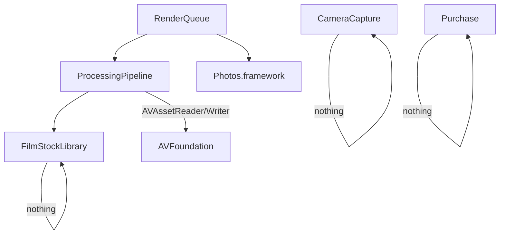

# Architecture Spine — iOS Film Emulation App (v1)

> **v1 scope:** Video capture with post-record film emulation render. No photos (v3). No save-clean-and-apply-later (v2). v1/v2/v3 roadmap: v1=video capture + post-record render, v2=save clean Log + apply/swap stocks later, v3=photos.

## Design Paradigm

**MVVM** — SwiftUI views observe `@Observable` ViewModels. One ViewModel per module. No UIKit. No Combine. Data flows down via observed state; user actions flow up via ViewModel methods.

```mermaid
graph TD
    V[SwiftUI View] -->|observes| VM[ViewModel]
    VM -->|owns| M[Module Logic]
    VM -->|exposes| S[@Observable state]
    V -->|calls| VM
```

## Invariants & Rules

### AD-1 — MVVM with @Observable

- **Binds:** all
- **Prevents:** UIKit dependencies, Combine publishers, TCA-style reducers, bare-MV without ViewModel layer
- **Rule:** Every screen is a SwiftUI View backed by exactly one `@Observable` ViewModel. ViewModels own module logic and expose `@Observable` state. Views call ViewModel methods for user actions. No `@StateObject`, no `@ObservedObject`, no `@Published` — Observation framework only.

### AD-2 — SwiftUI + iOS 17 minimum deployment

- **Binds:** all UI
- **Prevents:** UIKit views, iOS 16 fallback complexity, Combine-based ViewModel binding
- **Rule:** Deployment target iOS 17+. All UI is SwiftUI. `@Observable` macro for all ViewModels. async/await for async work. iOS 17 covers 92%+ active devices as of 2025.

### AD-3 — AVFoundation video capture, 24fps lock, clean preview

- **Binds:** CAP-2, CAP-3
- **Prevents:** Third-party camera SDKs, variable frame rates, real-time LUT/filter preview, manual focus overrides
- **Rule:** `AVCaptureSession` on a dedicated serial queue (never main thread). Video capture via `AVCaptureMovieFileOutput` with `activeColorSpace = .appleLog` and HEVC (H.265) encoding at 4K resolution. **Bitrate:** 36 Mbps target via `AVVideoAverageBitRateKey`. **Frame rate locked to 24fps** — `activeVideoMinFrameDuration = activeVideoMaxFrameDuration = CMTime(value: 1, timescale: 24)`. **Preview is clean** — `AVCaptureVideoPreviewLayer` shows the standard camera feed with no LUT, grain, or filter applied. Film look is only visible on the processed output file. **Focus:** native iPhone behavior via `AVCaptureDevice` tap-to-focus (`focusMode = .autoFocus`, `focusPointOfInterest`). Portrait mode (depth effect) available on supported devices via `AVCaptureDevice.DepthDataFormat`. **Free space:** display `URL(fileURLWithPath: NSHomeDirectory()).resourceValues(forKeys: [.volumeAvailableCapacityKey])` in UI.

### AD-4 — Shutter speed constraints

- **Binds:** CAP-3, CameraCapture
- **Prevents:** Shutter speeds outside the 1/24–1/100 range, underexposure compensation by exceeding the shutter cap
- **Rule:** Video shutter speed range: **1/24 (360° shutter angle)** minimum to **1/100 (hard cap)** maximum. Default: **1/48 (180°)** . If the exposure calculation demands a shutter faster than 1/100, the shutter caps at 1/100 and the image **overexposes** — no further compensation is applied. Shutter speed is set via `AVCaptureDevice.setExposureModeCustom(duration:iso:completionHandler:)` with the computed duration clamped to `[CMTime(value: 1, timescale: 24), CMTime(value: 1, timescale: 100)]`.

### AD-5 — Exposure state machine

- **Binds:** CAP-3, CameraCapture
- **Prevents:** Ad-hoc exposure logic spread across View and ViewModel, race conditions on lock state, shutter exceeding AD-4 caps
- **Rule:** Single `ExposureMode` enum owned by `CameraViewModel`:

```swift
enum ExposureMode {
    case auto                                  // 24fps, camera meters both
    case shutterPriority(lockedShutter: Float64) // ISO auto-adjusts to target EV
    case isoPriority(lockedISO: Float)          // Shutter auto-adjusts (clamped per AD-4)
    case manual(shutter: Float64, iso: Float)   // No auto; EV indicator shows over/under
}
```

Target EV (`Float`, default 0.0) always present and user-adjustable. Tapping shutter or ISO toggles lock. Exposure calculation solves for unlocked parameter given locked value + target EV + metered brightness. Shutter output is always clamped to AD-4 range. ISO range: device-reported `activeFormat.minISO` to `activeFormat.maxISO`.

### AD-6 — Metal GPU pipeline, hybrid 2-pass, post-record

- **Binds:** CAP-6, CAP-7
- **Prevents:** Real-time capture processing, Core Image for grain, CPU-side processing, processing during recording
- **Rule:** Processing is a **post-record render step** — it runs after recording completes, not during capture. **Pass 1** fuses LUT application, halation, and glow into a single Metal fragment shader. LUT sampled via 3D color lookup texture from bundled `.cube` files. **Pass 2** applies grain: 3D noise volume (128³) sampled per-frame for temporal coherence (AD-9). Pass order fixed: Pass 1 output feeds Pass 2 input. Input: `.mov` file URL (Apple Log, HEVC H.265, 4K, 24fps). Output: new `.mov` file (HEVC H.265, 4K, ~36 Mbps). Pipeline uses `AVAssetReader` for frame extraction and `AVAssetWriter` for output. Metal shaders: `pipeline.metal` (Pass 1) and `grain.metal` (Pass 2).

### AD-7 — Render queue

- **Binds:** CAP-6, ProcessingPipeline
- **Prevents:** Blocking the camera during render, concurrent renders competing for GPU, lost render jobs
- **Rule:** A serial `OperationQueue` (`maxConcurrentOperationCount = 1`) processes render jobs sequentially. Each job: `{ sourceURL: URL, stockConfig: FilmStockConfig, trimRange: CMTimeRange? }`. Jobs are enqueued after recording stops. The camera remains available for new recordings while the queue processes. Queue state is `@Observable` on `ProcessingViewModel`: `pendingCount`, `currentJob`, `isProcessing`. Completed jobs save the processed `.mov` to the camera roll via Photos framework. Failed jobs surface an error and remain in queue for retry. Queue persists across app backgrounding by saving job metadata to disk (Codable JSON).

### AD-8 — Clip limits and free space

- **Binds:** CAP-2, CameraCapture
- **Prevents:** Unbounded recordings filling device storage, recording when space is critically low
- **Rule:** Maximum single clip duration: **5 minutes** (300 seconds). Recording auto-stops at the limit. UI shows a countdown timer. Free space is polled every 5 seconds during recording and displayed as a bar/percentage. Recording is blocked if free space < 500MB. Space check: `URL(fileURLWithPath: NSHomeDirectory()).resourceValues(forKeys: [.volumeAvailableCapacityForImportantUsageKey])`.

### AD-9 — Grain model (video only)

- **Binds:** CAP-7, ProcessingPipeline
- **Prevents:** Static grain overlay (flickering), per-stock grain textures (v1 complexity), uncorrelated per-frame noise
- **Rule:** **3D noise volume**, 128³, stored as `grain3d.raw` in app bundle under `Resources/Grain/`. Each frame samples a z-slice at `z = frameIndex % 128`. ISO slider (per-stock) scales grain intensity via linear blend in the Metal shader. Single volume shared across all film stocks — ISO slider differentiates the look. Shipped in app bundle. No runtime generation. Photo grain texture (`grain.png`) is bundled but unused in v1 — ready for v3.

### AD-10 — FilmStockConfig contract

- **Binds:** CAP-6, CAP-7, ProcessingPipeline, FilmStockLibrary
- **Prevents:** Ad-hoc stock parameter passing, stringly-typed stock identifiers, render pipeline ignorance of stock characteristics
- **Rule:** `FilmStockConfig` is a value type (struct):

```swift
struct FilmStockConfig {
    let stockId: String
    let lutName: String            // .cube filename
    let iso: Float                 // user-set, drives grain intensity
    let halationStrength: Float    // per-stock constant
    let glowStrength: Float        // per-stock constant
}
```

FilmStockLibrary exposes single factory: `func config(for stockId: String, iso: Float) -> FilmStockConfig`. Callers request configs through this method — never construct directly. ISO is a runtime parameter; all other fields loaded from `stocks.json`.

### AD-11 — Trim (deferred to v2)

- **Binds:** CAP-5 (v2)
- **Prevents:** (deferred)
- **Rule:** Deferred to v2. Trim will use `AVAssetReader.timeRange` for non-destructive clip trimming before render. Not implemented in v1.

### AD-12 — Bundled assets

- **Binds:** FilmStockLibrary
- **Prevents:** Hardcoded file paths, runtime asset downloading, mutable bundled resources
- **Rule:** All film stock assets ship in app bundle:

```text
Resources/
  LUTs/
    kodak250d.cube
    kodak500t.cube
  Grain/
    grain3d.raw
    grain.png         # unused in v1, ready for v3
  stocks.json         # FilmStockConfig definitions per stock
  Shaders/
    pipeline.metal    # Pass 1 (LUT + halation + glow)
    grain.metal       # Pass 2 (grain)
```

`stocks.json` is the single source of truth for stock metadata. FilmStockLibrary reads it at launch. v1 stocks: Kodak 250D and 500T (video only). Photo stocks bundled but unused — ready for v3.

### AD-13 — Dependency direction

- **Binds:** all modules
- **Prevents:** Circular imports, CameraCapture knowing about film stocks, RenderQueue importing CameraCapture internals
- **Rule:** Dependency graph:



CameraCapture produces `.mov` file URL (not CVPixelBuffer). ProcessingPipeline consumes `.mov` URL + `FilmStockConfig`, produces processed `.mov` URL. RenderQueue owns the serial `OperationQueue`, enqueues jobs from CameraCapture, invokes ProcessingPipeline per job, saves output via Photos. No module imports another module's ViewModel directly.

## Consistency Conventions

| Concern | Convention |
| --- | --- |
| Naming | ViewModels: `{Domain}ViewModel`. Modules: folders matching module names. Metal shaders: `<effect>.metal`. |
| Data & formats | Grain volume: raw 128³ float32. LUTs: `.cube` format, 33³ or 65³. Render job metadata: JSON (`Codable`), persisted to `renderQueue.json` in app documents. |
| State & cross-cutting | All ViewModel state `@Observable` on `@MainActor`. Camera session queue: dedicated `DispatchQueue(label: "camera.session")`. Render queue: serial `OperationQueue`. No `DispatchQueue.main.async` in capture or render pipeline. |
| Error handling | Render failures surface as `@Observable` alert state with retry option. Camera permission denied is a first-launch handled case. Low-space warning at 1GB remaining, block at 500MB. |
| Threading | Camera session: dedicated serial queue. Metal rendering: `.concurrent` queue. Render queue: serial (one job at a time). UI observation: `@MainActor`. |

## Stack

| Name | Version |
| --- | --- |
| Swift | 6 |
| SwiftUI | 6 (iOS 18 SDK) |
| Xcode | 16+ |
| iOS deployment target | 17.0 |
| AVFoundation | iOS 17+ (Apple Log, HEVC H.265 4K) |
| Metal | 3 (Metal Shading Language) |
| Photos framework | iOS 17+ |
| StoreKit | 2 (iOS 17+ Swift-native APIs) |

> **Note:** Spec references "Apple Log 2" — actual AVFoundation API is `AVCaptureColorSpace.appleLog`. No "Apple Log 2" exists. Spec should be updated. Apple Log color space requires iPhone 13 Pro or newer. HEVC at 4K 36 Mbps: ~270 MB/minute, 5-min clip ~1.35 GB.

## Structural Seed

```text
App/
  Modules/
    CameraCapture/
      CameraViewModel.swift        # Exposure mode, record control, free space
      CameraSession.swift          # AVCaptureSession, 24fps lock, clean preview
      ExposureStateMachine.swift   # AD-5 enum + AD-4 shutter caps
      FocusManager.swift           # Tap-to-focus, portrait mode
    ProcessingPipeline/
      ProcessingViewModel.swift    # Stock selection, ISO slider, render trigger
      PipelineRenderer.swift       # Metal setup, AVAssetReader/Writer orchestration
    FilmStockLibrary/
      FilmStockConfig.swift        # AD-10 struct
      StockLoader.swift            # Reads stocks.json + bundled .cube/grain
    RenderQueue/
      RenderQueueViewModel.swift   # Queue state (pending, current, completed)
      RenderJob.swift              # Codable job model
      QueuePersister.swift         # JSON persistence for backgrounding
    Purchase/
      PurchaseViewModel.swift
      StoreManager.swift           # StoreKit 2, 7-day trial
  Resources/
    LUTs/                          # .cube files (250D, 500T + photo stocks for future)
    Grain/
      grain3d.raw
      grain.png                    # unused, v3
    stocks.json
    Shaders/
      pipeline.metal
      grain.metal
  App/
    App.swift                      # @main
    ContentView.swift              # Camera view + render queue status
```

## Capability → Architecture Map

| Capability | Lives in | Governed by |
| --- | --- | --- |
| CAP-2 (Apple Log video capture) | `CameraCapture/CameraSession.swift` | AD-3, AD-4, AD-8 |
| CAP-3 (exposure lock/auto-expose) | `CameraCapture/ExposureStateMachine.swift` | AD-4, AD-5 |
| CAP-5 (trim video) | Deferred to v2 | AD-11 (deferred) |
| CAP-6 (processing pipeline) | `ProcessingPipeline/PipelineRenderer.swift` | AD-6, AD-7, AD-10 |
| CAP-7 (grain, real-time GPU) | `ProcessingPipeline/`, `Shaders/grain.metal` | AD-6, AD-9 |
| CAP-9 (purchase/trial) | `Purchase/StoreManager.swift` | (self-contained) |

> **v1 does not cover:** CAP-1 (RAW photo — v3), CAP-4 (post-capture save-clean — v2), CAP-8 (keep/discard toggle — simplified: always keep original in v1), CAP-10 (point-and-shoot photo — v3).

## Deferred

- **Photos (v3):** RAW capture, photo grain texture, photo processing pipeline. Architecture structured to accept photo inputs when ready.
- **Post-capture workflow (v2):** Save clean Apple Log, in-app library, apply/swap stocks after capture. Current v1 always processes post-record; the clean Log is kept but there's no library UI for re-processing.
- **Custom LUT import:** Not in v1-v3 scope currently.
- **Android:** Entirely separate architecture. Not addressed.
- **Community preset sharing:** Requires networking, auth, server. Deferred indefinitely.
- **Aperture control:** No iPhone has physical variable aperture as of 2025. `ExposureMode` enum structured to add aperture field without breaking changes when hardware supports it.
- **Non-24fps frame rates:** v1 locks to 24fps. If other frame rates are added, AD-4 shutter range must be recalculated per frame rate (shutter angle → absolute time mapping changes).